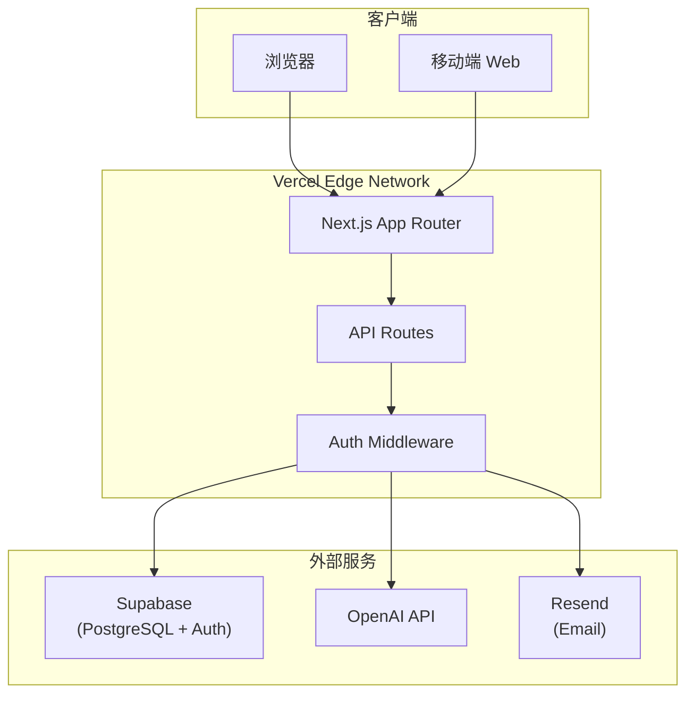
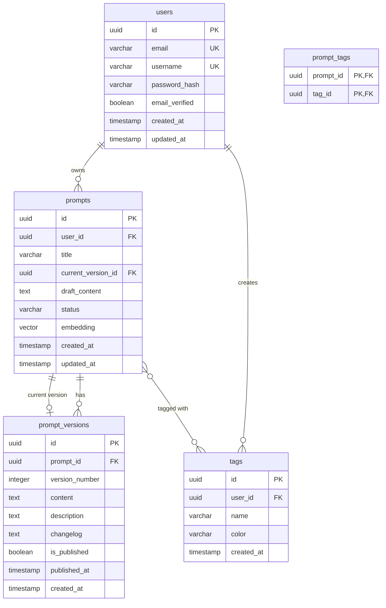

# 提示词管理平台技术方案文档

> **版本**: v1.0  
> **日期**: 2026-01-19  
> **基于**: PRD v2.0

---

## 1. 文档概述

### 1.1 目的

本文档为「提示词管理平台」项目的技术实现方案，详细描述系统架构设计、数据库设计、API 接口规范、前端组件设计、安全策略及部署方案，为开发团队提供明确的技术指导。

### 1.2 范围

覆盖 MVP（V1.0）及 V1.1 版本的所有功能模块：

- 用户认证与授权
- 提示词 CRUD 与版本控制
- AI 诊断与优化
- 标签系统与搜索

---

## 2. 系统架构设计

### 2.1 整体架构



### 2.2 技术栈确认

| 层级              | 技术选型              | 版本要求 | 用途              |
| ----------------- | --------------------- | -------- | ----------------- |
| **Runtime**       | Node.js               | 24+      | 服务端运行时      |
| **Framework**     | Next.js (App Router)  | 16+      | 全栈框架          |
| **Language**      | TypeScript            | 5.0+     | 类型安全          |
| **Styling**       | Tailwind CSS          | 4+       | 原子化样式        |
| **UI Components** | shadcn/ui             | latest   | 组件库            |
| **Database**      | PostgreSQL + pgvector | 15+      | 数据存储+向量搜索 |
| **ORM**           | Drizzle ORM           | 0.30+    | 类型安全 ORM      |
| **Auth**          | Supabase Auth         | latest   | 认证服务          |
| **AI SDK**        | Vercel AI SDK         | 3.0+     | AI 集成           |
| **State**         | Zustand               | 4.0+     | 客户端状态        |
| **Forms**         | react-hook-form + zod | 7.0+     | 表单验证          |

### 2.3 目录结构设计

```
prompt-hub/
├── src/
│   ├── app/                          # Next.js App Router
│   │   ├── (marketing)/              # 公开页面
│   │   │   ├── page.tsx              # 首页
│   │   │   └── layout.tsx
│   │   ├── (auth)/                   # 认证页面
│   │   │   ├── login/page.tsx
│   │   │   ├── register/page.tsx
│   │   │   └── layout.tsx
│   │   ├── (dashboard)/              # 应用主页面
│   │   │   ├── layout.tsx
│   │   │   └── dashboard/
│   │   │       ├── page.tsx
│   │   │       └── prompts/
│   │   │           ├── page.tsx
│   │   │           ├── new/page.tsx
│   │   │           └── [id]/
│   │   │               ├── page.tsx
│   │   │               └── edit/page.tsx
│   │   └── api/                      # API Routes
│   │       ├── auth/
│   │       ├── prompts/
│   │       ├── tags/
│   │       └── ai/
│   ├── components/
│   │   ├── ui/                       # shadcn/ui
│   │   ├── layout/
│   │   ├── prompts/
│   │   ├── tags/
│   │   ├── ai/
│   │   └── shared/
│   ├── lib/
│   │   ├── db/
│   │   ├── auth/
│   │   ├── ai/
│   │   ├── validations/
│   │   └── utils.ts
│   ├── hooks/
│   ├── stores/
│   └── types/
├── drizzle/
├── tests/
└── package.json
```

---

## 3. 数据库设计

### 3.1 ER 图



### 3.2 Drizzle Schema

```typescript
// src/lib/db/schema.ts
import {
  pgTable,
  uuid,
  varchar,
  text,
  boolean,
  timestamp,
  integer,
  index,
  uniqueIndex,
  vector,
} from "drizzle-orm/pg-core";
import { relations } from "drizzle-orm";

export const users = pgTable(
  "users",
  {
    id: uuid("id").primaryKey().defaultRandom(),
    email: varchar("email", { length: 255 }).notNull().unique(),
    username: varchar("username", { length: 50 }).notNull().unique(),
    passwordHash: varchar("password_hash", { length: 255 }).notNull(),
    emailVerified: boolean("email_verified").default(false),
    createdAt: timestamp("created_at", { withTimezone: true }).defaultNow(),
    updatedAt: timestamp("updated_at", { withTimezone: true }).defaultNow(),
  },
  (table) => ({
    emailIdx: index("idx_users_email").on(table.email),
  }),
);

export const prompts = pgTable(
  "prompts",
  {
    id: uuid("id").primaryKey().defaultRandom(),
    userId: uuid("user_id")
      .notNull()
      .references(() => users.id, { onDelete: "cascade" }),
    title: varchar("title", { length: 200 }).notNull(),
    currentVersionId: uuid("current_version_id"),
    draftContent: text("draft_content"),
    status: varchar("status", { length: 20 }).default("draft"),
    embedding: vector("embedding", { dimensions: 1536 }),
    createdAt: timestamp("created_at", { withTimezone: true }).defaultNow(),
    updatedAt: timestamp("updated_at", { withTimezone: true }).defaultNow(),
  },
  (table) => ({
    userIdIdx: index("idx_prompts_user_id").on(table.userId),
    statusIdx: index("idx_prompts_status").on(table.status),
  }),
);

export const promptVersions = pgTable("prompt_versions", {
  id: uuid("id").primaryKey().defaultRandom(),
  promptId: uuid("prompt_id")
    .notNull()
    .references(() => prompts.id, { onDelete: "cascade" }),
  versionNumber: integer("version_number").notNull(),
  content: text("content").notNull(),
  description: text("description"),
  changelog: text("changelog"),
  isPublished: boolean("is_published").default(false),
  publishedAt: timestamp("published_at", { withTimezone: true }),
  createdAt: timestamp("created_at", { withTimezone: true }).defaultNow(),
});

export const tags = pgTable("tags", {
  id: uuid("id").primaryKey().defaultRandom(),
  userId: uuid("user_id")
    .notNull()
    .references(() => users.id, { onDelete: "cascade" }),
  name: varchar("name", { length: 50 }).notNull(),
  color: varchar("color", { length: 7 }).default("#6366f1"),
  createdAt: timestamp("created_at", { withTimezone: true }).defaultNow(),
});

export const promptTags = pgTable("prompt_tags", {
  promptId: uuid("prompt_id")
    .notNull()
    .references(() => prompts.id, { onDelete: "cascade" }),
  tagId: uuid("tag_id")
    .notNull()
    .references(() => tags.id, { onDelete: "cascade" }),
});
```

---

## 4. API 接口规范

### 4.1 通用规范

- **基础路径**: `/api`
- **认证方式**: Bearer Token (JWT) / Session Cookie
- **响应格式**: JSON
- **时间格式**: ISO 8601

### 4.2 认证接口

| 方法 | 路径                 | 描述         |
| ---- | -------------------- | ------------ |
| POST | `/api/auth/register` | 用户注册     |
| POST | `/api/auth/login`    | 用户登录     |
| POST | `/api/auth/logout`   | 用户登出     |
| GET  | `/api/auth/me`       | 获取当前用户 |

### 4.3 提示词接口

| 方法   | 路径               | 描述       |
| ------ | ------------------ | ---------- |
| GET    | `/api/prompts`     | 获取列表   |
| POST   | `/api/prompts`     | 创建提示词 |
| GET    | `/api/prompts/:id` | 获取详情   |
| PATCH  | `/api/prompts/:id` | 更新草稿   |
| DELETE | `/api/prompts/:id` | 删除       |

### 4.4 版本接口

| 方法 | 路径                                     | 描述       |
| ---- | ---------------------------------------- | ---------- |
| GET  | `/api/prompts/:id/versions`              | 版本列表   |
| POST | `/api/prompts/:id/versions`              | 发布新版本 |
| POST | `/api/prompts/:id/versions/:vid/restore` | 恢复版本   |

### 4.5 AI 接口

| 方法 | 路径               | 描述         |
| ---- | ------------------ | ------------ |
| POST | `/api/ai/diagnose` | 诊断质量     |
| POST | `/api/ai/optimize` | 优化（流式） |

### 4.6 标签接口

| 方法   | 路径            | 描述     |
| ------ | --------------- | -------- |
| GET    | `/api/tags`     | 获取列表 |
| POST   | `/api/tags`     | 创建标签 |
| PATCH  | `/api/tags/:id` | 更新     |
| DELETE | `/api/tags/:id` | 删除     |

---

## 5. 前端组件设计

### 5.1 核心组件

| 组件              | 用途            |
| ----------------- | --------------- |
| `PromptEditor`    | Markdown 编辑器 |
| `PromptPreview`   | 渲染预览        |
| `VersionSelector` | 版本切换        |
| `VersionDiff`     | 版本对比        |
| `TagSelector`     | 标签选择        |
| `DiagnoseDialog`  | AI 诊断弹窗     |
| `StatusBadge`     | 状态标签        |

### 5.2 状态管理

```typescript
// Zustand Store 结构
interface PromptState {
  currentPrompt: Prompt | null;
  draftContent: string;
  isDirty: boolean;
  setCurrentPrompt: (prompt: Prompt | null) => void;
  updateDraft: (content: string) => void;
  saveDraft: () => Promise<void>;
  publish: (description?: string) => Promise<void>;
}

interface FilterState {
  status: "all" | "draft" | "published";
  tagIds: string[];
  searchQuery: string;
  setStatus: (status: FilterState["status"]) => void;
  toggleTag: (tagId: string) => void;
  setSearchQuery: (query: string) => void;
}
```

---

## 6. 安全设计

### 6.1 认证安全

| 措施        | 实现                       |
| ----------- | -------------------------- |
| 密码哈希    | bcrypt, cost = 12          |
| JWT 有效期  | Access: 1h, Refresh: 7d    |
| 登录限制    | 5次失败锁定15分钟          |
| Cookie 安全 | HttpOnly, Secure, SameSite |

### 6.2 速率限制

| 接口 | 限制 | 窗口  |
| ---- | ---- | ----- |
| 登录 | 5次  | 1分钟 |
| AI   | 10次 | 1分钟 |
| 其他 | 60次 | 1分钟 |

### 6.3 数据安全

- RLS 策略: PostgreSQL 行级安全
- XSS 防护: DOMPurify 清理 Markdown
- SQL 注入: Drizzle ORM 参数化查询

---

## 7. 性能优化

### 7.1 前端

- 路由级代码分割
- Markdown 编辑器动态导入
- react-window 虚拟滚动
- TanStack Query 缓存

### 7.2 数据库

- 复合索引设计
- 向量索引 (HNSW)
- 连接池 (Supabase Pooler)

---

## 8. 部署方案

### 8.1 环境变量

```bash
DATABASE_URL=postgresql://...
NEXT_PUBLIC_SUPABASE_URL=https://xxx.supabase.co
NEXT_PUBLIC_SUPABASE_ANON_KEY=xxx
OPENAI_API_KEY=sk-xxx
NEXT_PUBLIC_APP_URL=https://prompt-hub.vercel.app
```

### 8.2 CI/CD

- GitHub Actions: lint → test → build → deploy
- Vercel: 自动部署 main 分支

---

## 9. 开发里程碑

| 阶段    | 周期     | 内容               |
| ------- | -------- | ------------------ |
| Phase 1 | Week 1   | 基础框架 + 认证    |
| Phase 2 | Week 2-3 | 提示词 CRUD + 版本 |
| Phase 3 | Week 4   | AI 集成            |
| Phase 4 | Week 5-6 | 测试 + 部署        |

---

> **待确认**: 请审核本技术方案，批准后进入开发阶段。
